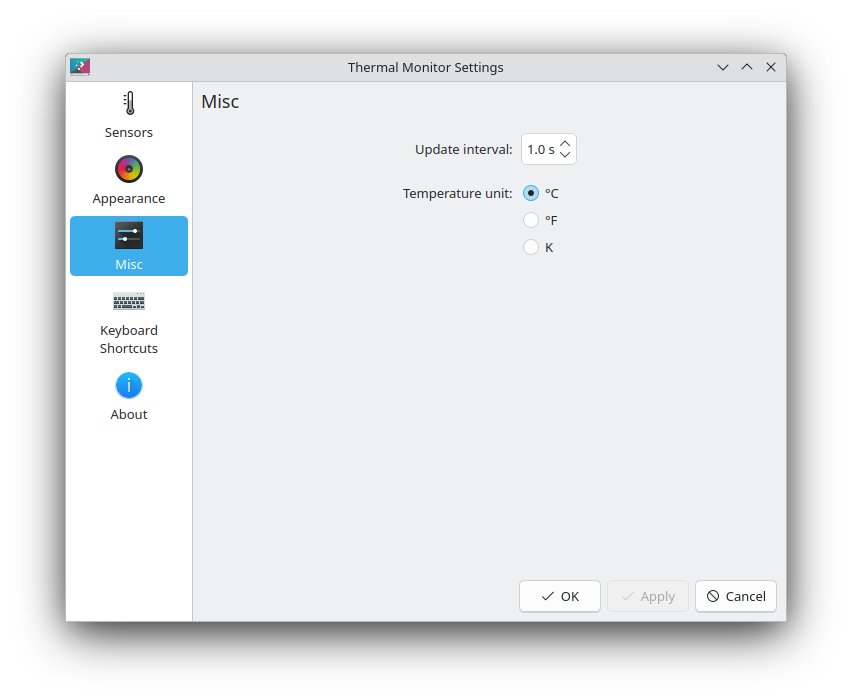

# Thermal Monitor

A KDE Plasmoid for displaying system temperatures.


<details><summary>Settings screenshots</summary>

| Sensors | Appearance | Misc |
| ------- | ---------- | ---- |
|  |  |  |
</details>

Inspired by:

 - https://github.com/kotelnik/plasma-applet-thermal-monitor
 - and its fork https://gitlab.com/agurenko/plasma-applet-thermal-monitor

This applet uses `libksysguard` for retrieving temperature information provided by `ksystemstats`.

## Usage

Add the applet to either the panel or the desktop. To add sensors to display, right click the applet and configure.

Sensors can be added and renamed through the "Add Sensors…" button. To export sensors to the clipboard, and copy from, the import/export options can be used.

The libraries `ksystemstats`, `libksysguard`, `kitemmodels` and `kdeclarative` must be installed.

## Installation

It is recommended to install the applet via "Get New…" or Discover, which obtain the applet [from the KDE Store](https://store.kde.org/p/2070765). Manual installation is only required for development and testing.

```bash
git clone https://invent.kde.org/olib/thermalmonitor.git
cd thermalmonitor
cmake . && sudo make install
```

Ensure you are using the correct branch. Plasma 5 users need to use branch `kf5`.

It may be necesary to restart Plasma after installing.

### kdesrc-build

The applet can be installed into kdesrc-build's prefix:

```bash
cmake -B build -DCMAKE_PREFIX_PATH="~/kde/usr" -DCMAKE_INSTALL_PREFIX="~/kde/usr"
cd build && make install
```

## Uninstallation

If you have installed the applet via "Get New…" or Discover, you can remove it there.

```bash
sudo make uninstall
```

There is no need to use sudo for kdesrc-build installations.
