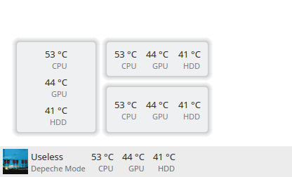

# Thermal Monitor

A KDE Plasmoid for displaying system temperatures.



Inspired by:

 - https://github.com/kotelnik/plasma-applet-thermal-monitor
 - and its fork https://gitlab.com/agurenko/plasma-applet-thermal-monitor

This applet uses `libksysguard` for retrieving temperature information provided by `ksystemstats`.

## Usage

Add the applet to either the panel or the desktop. To add sensors to display, right click the applet and configure.

Sensors can be added and renamed through the "Add Sensors…" button. To export sensors to the clipboard, and copy from, the import/export options can be used.

The libraries `ksystemstats`, `libksysguard`, `kitemmodels` and `kdeclarative` must be installed.

## Installation

```bash
git clone https://invent.kde.org/olib/thermalmonitor.git
cd thermalmonitor
cmake . && sudo make install
kquitapp5 plasmashell && kstart5 plasmashell &>/dev/null
```

For Plasma 6 built by kdesrc-build, you can do:

```bash
cmake -S . -B build -DCMAKE_PREFIX_PATH="~/kde/usr" -DCMAKE_INSTALL_PREFIX="~/kde/usr"
cd build && make install
```

## Uninstallation

```bash
sudo make uninstall
```
