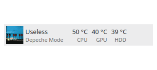
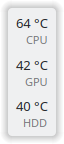

# Thermal Monitor

A KDE Plasmoid for displaying system temperature information.




## Usage

Add the applet to either the panel or the desktop. To add sensors to display, right click the applet and configure.

The libraries `ksystemstats`, `libksysguard` and `kitemmodels` are required.

## Installation

```bash
git clone https://invent.kde.org/olib/thermalmonitor.git
cd thermalmonitor
cmake . && sudo make install
kquitapp5 plasmashell && kstart5 plasmashell &>/dev/null
```

For Plasma 6 built by kdesrc-build, you can do:

```bash
cmake -S . -B build -DCMAKE_PREFIX_PATH="~/kde/usr" -DCMAKE_INSTALL_PREFIX="~/kde/usr"
cd build && make install
```

## Uninstallation

```bash
sudo make uninstall
```
