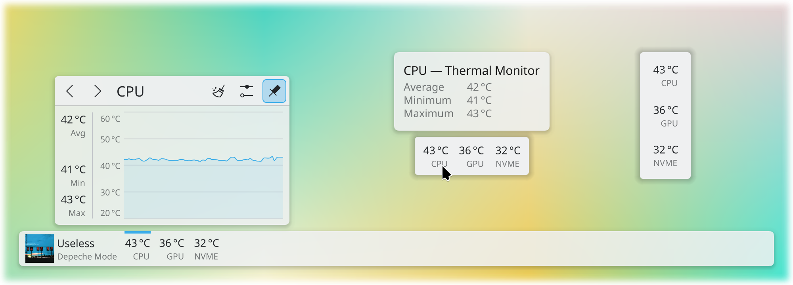

# Thermal Monitor

System temperatures at a glance




Inspired by:

 - https://github.com/kotelnik/plasma-applet-thermal-monitor
 - and its fork https://gitlab.com/agurenko/plasma-applet-thermal-monitor

This applet uses `libksysguard` for retrieving temperature information provided by `ksystemstats`.

## Usage

Add the applet to either the panel or the desktop. To add sensors to display, click the applet and configure.

Sensors can be added and renamed through the "Add Sensors…" button. To export sensors to the clipboard, and copy from, the import/export buttons can be used.

The libraries `ksystemstats`, `libksysguard`, `kitemmodels`, `kdeclarative`, `kquickcharts` must be installed. They are dependencies of even a minimal Plasma installation, so they should already be installed.

## Installation

It is recommended to install the applet via "Get New…" or Discover, which obtain the applet [from the KDE Store](https://store.kde.org/p/2100418). Manual installation is only required for development and testing.

There is no compiled content, so the plasmoid can be trivially installed by copying files.

It is necesary to restart Plasma after installing:

`systemctl restart --user plasma-plasmashell.service`

### Script

```bash
./plasmoid-replace.sh
```

### CMake

```bash
git clone https://invent.kde.org/olib/thermalmonitor.git
cd thermalmonitor
cmake . && sudo make install
```

Ensure you are using the correct branch. Plasma 5 users need to use branch `kf5`.

### kdesrc-build

The applet can be installed into kdesrc-build's prefix:

```bash
cmake -B build -DCMAKE_PREFIX_PATH="~/kde/usr" -DCMAKE_INSTALL_PREFIX="~/kde/usr"
cd build && make install
```

## Uninstallation

If you have installed the applet via "Get New…" or Discover, you can remove it there.

### Script

Simply remove `~/.local/share/plasma/plasmoids/org.kde.olib.thermalmonitor`.

### CMake

```bash
sudo make uninstall
```

There is no need to use sudo for kdesrc-build installations.
